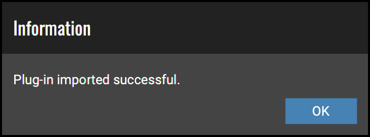
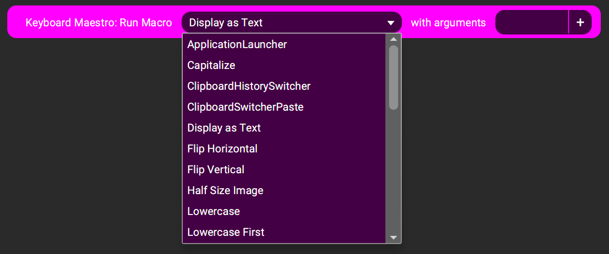

# Touch Portal Keyboard Maestro Plugin

- [Touch Portal Keyboard Maestro Plugin](#touch-portal-keyboard-maestro-plugin)
  - [Intro](#intro)
  - [Requirements](#requirements)
  - [Instructions](#instructions)
- [Bugs/Ehancements](#bugsehancements)
- [Dependencies](#dependencies)
- [Versioning](#versioning)
- [Authors](#authors)
- [License](#license)

## Intro

This plugin is for MacOS Only. [Keyboard Maestro](https://www.keyboardmaestro.com/main/) is a program that can "automate applications or web sites, text or images, simple or complex, on command or scheduled. You can automate virtually anything." (pulled from Keyboard Maestro Website).

This plugin is not created by, nor supported by Keyboard Maestro. Any questions/concerns should be directed through the [Github Issues](https://github.com/spdermn02/TouchPortal_KeyboardMaestro_Plugin/issues) or through the #keyboard-maestro channel on the [Official Touch Portal Discord](https://discord.gg/MgxQb8r)

## Requirements

- MacOS
- Touch Portal Pro Upgrade - Purchasable through iOS or Android Touch Portal App
- Touch Portal Installed on the Mac
- [Keyboard Maestro](https://www.keyboardmaestro.com/main/)

## Instructions
1) Download the .tpp file from the [Release](https://github.com/spdermn02/TouchPortal_KeyboardMaestro_Plugin/releases) page
2) In Touch Portal select the Wrench icon and `Import plug-in`
3) Navigate to where the .tpp file was downloaded and select it, click `Ok`
4) Upon first import it will present you 2 dialogs
   1) One says `Plug-in imported successful` Click `OK` button

      

   2) On the one that asks for trust, if you click `OK` it will ask again when Touch Portal is reopened. Chosing `Trust Always` will prevent this popup coming up again.
5) If this is your first Touch Portal plugin, please fully quit and start Touch Portal
6) Click on the button you want to add the action to, scroll down to Keyboard Maestro and click `Run Macro` to add the action

   

7) Select the macro you want to execute from the list that is provided, and click `Save`

   

8) Congrats you now can execute a Keyboard Maestro macro directly from touchportal. Or several in a row, it's up to you!

# Bugs/Ehancements

Issues and Bugs can be reported through [GitHub Issues](https://github.com/spdermn02/TouchPortal_KeyboardMaestro_Plugin/issues) or through the [Official Touch Portal Discord](https://discord.gg/MgxQb8r) and channel #keyboard-maestro

# Dependencies
 - [bplist-parser](https://www.npmjs.com/package/bplist-parser)
 - [touchportal-api](https://www.npmjs.com/package/touchportal-api)

# Versioning

We use [SemVer](http://semver.org/) for versioning. For the versions available, see the [tags on this repository](https://github.com/spdermn02/tpohm_plugin/tags).

# Authors

- **Jameson Allen** - _Initial work_ - [Spdermn02](https://github.com/spdermn02)
- **Dominik Svoboda** - Bug Fixes - [jerayan](https://github.com/jerayan)

# License

This project is licensed under the MIT License - see the [LICENSE](LICENSE) file for details
